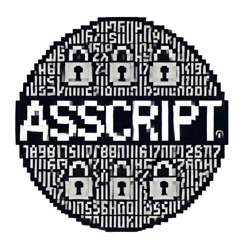

<div align="center">
  <h1>QR Code Generator with Custom Logo</h1>
  
</div>

SecureFile is a robust, military-grade file encryption tool built for the Kali Linux environment. Designed with security in mind, SecureFile ensures that your sensitive data remains protected from unauthorized access. This utility leverages advanced cryptographic algorithms and modern security practices to provide unparalleled file encryption and decryption capabilities.

## Features

- **Strong Encryption**: Utilizes AES-GCM with Argon2 for key derivation, ensuring high security.
- **File Integrity Checks**: Incorporates HMAC to verify file integrity during encryption and decryption.
- **Cross-Format Support**: Works with any file format, from text files to images and executables.
- **Metadata Protection**: Encrypts file metadata to prevent leakage of sensitive information.
- **Error Handling**: Provides clear error messages for incorrect inputs and potential security issues.
- **File Deletion**: Securely deletes original files after encryption/decryption, minimizing the risk of data leakage.
- **Kali Linux Integration**: Seamlessly integrates with the Kali Linux environment for easy deployment.

## Table of Contents

- [Installation](#installation)
- [Usage](#usage)
  - [Encrypting Files](#encrypting-files)
  - [Decrypting Files](#decrypting-files)
- [Advanced Security Features](#advanced-security-features)
- [Contributing](#contributing)
- [License](#license)

## Installation

### Prerequisites

Before installing SecureFile, ensure you have the following dependencies installed:

- Python 3.10 or later
- `pip` (Python package installer)
- Kali Linux (or compatible Linux environment)

### Basic Setup

Follow these steps to clone the project, configure it, and start using SecureFile.

1. **Clone the repository:**

   ```bash
   git clone https://github.com/brianparkerin/asscrypt.git
   cd securefile
   ```

2. **Install the required Python packages:**

   ```bash
   pip install -r requirements.txt
   ```

3. **(Optional) Add SecureFile to your system path:**

   ```bash
   echo "export PATH=\$PATH:/path/to/securefile" >> ~/.bashrc
   source ~/.bashrc
   ```

4. **Test the installation:**

You can check if everything is installed correctly by running the help command:

   ```bash
   pip install -r requirements.txt
   ```

If the script runs without errors, you are all set.


## Usage

### Encrypting Files

To encrypt a file, run the encriptar.py script:

   ```bash
   python3 asscrypt.py
   ```

The script will prompt you for the following:

1. **File to Encrypt:** Enter the name of the file you wish to encrypt.
2. **Password:** Enter a secure password for encryption.
3. **Fake Name:** Enter a name for the encrypted file (e.g., “`fakefile.pdf`”). The original file will be securely deleted.


### Example:

   ```bash
   python3 asscrypt.py
   *Welcome to AssCrypt & thanks for use it!
   *Select the option what you wanna do?
   > 1. Encrypt
   > 2. Decrypt 
   # Enter the name of the file to encrypt: secretfile.txt
   # Enter the password: [hidden input]
   # Enter the fake name for the encrypted file: fakefile.pdf
   ```

### Decrypting Files

To decrypt an encrypted file, run the “`asscrypt.py`” script again as pretty much the same way to encrypt the files:

   ```bash
   python3 asscrypt.py
   ```
The script will prompt you for the following:

1. **File to Decrypt:** Enter the name of the encrypted file.
2. **Password:** Enter a secure password for encryption.
3. **Fake Name:**  Enter the correct password for decryption. The decrypted file will be restored with its original name, and the encrypted file will be securely deleted.

### Example:

   ```bash
   python3 asscrypt.py
   *Welcome to AssCrypt & thanks for use it!
   *Select the option what you wanna do?
   > 1. Encrypt
   > 2. Decrypt
   # Enter the name of the file to decrypt: fakefile.pdf
   # Enter the password: [hidden input]
   ```

### Advanced Security Features


- HMAC for Integrity: Ensures that your file has not been tampered with during encryption or decryption.

- Argon2 Key Derivation: Protects against brute-force attacks by generating a secure key from your password.

- Metadata Encryption: Prevents attackers from gaining insights into your file’s contents.

- Strict File Permissions: Sets encrypted files to read-only, making them resistant to unauthorized modifications.

- Error Handling: Provides detailed messages for incorrect passwords, missing files, or corrupted data.


### Contributing

We welcome contributions from the community! To contribute:

1. Fork the repository.
2. Create a new branch for your feature or bugfix (`git checkout -b feature-name`).
3. Commit your changes (`git push origin feature-name`).
4. Push to the branch (`git push origin feature-name`).
5. Open a pull request and describe your changes.

Please ensure your code follows the project's coding standards and includes appropriate tests.


### License

This project is licensed under the MIT License. See the [LICENSE](#license) file for more details.


___


